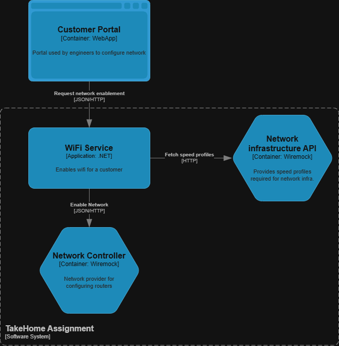

## 📄 Take-Home Assignment — O&Si Developer

### 🧠 Objective

Clone this repository and build a small REST API that can **activate WiFi for a customer**.

### 📘 Background

When a customer purchases WiFi service at **Vodafone Ziggo**, a store front officer
enters the customer's details into a portal. This portal will send customer data to
**your API** in JSON format.

To activate the WiFi, your API must:

1. **Receive** the customer data.
2. **Fetch additional network information** from the Network Infrastructure API.
3. **Assemble a payload** using both sources of information.
4. **Send a request** to the **network controller** to activate the WiFi service.

---

### Component overview



---

### 📥 Input: Customer Data

Your API will receive a request from the customer portal with the following JSON data:

```json
{
  "externalId": "ACT-20251017-001",
  "description": "Activate WiFi service for VFZ customer",
  "orderItem": {
    "id": "1",
    "service": {
      "id": "",
      "serviceSpecification": {
        "id": "SPEC-WIFI-001",
        "name": "WiFi Service"
      },
      "serviceCharacteristic": [
        {
          "name": "customerId",
          "valueType": "string",
          "value": {
            "@type": "string",
            "customerId": "CUST-4589"
          }
        },
        {
          "name": "customerName",
          "valueType": "string",
          "value": {
            "@type": "string",
            "customerName": "Alice Johnson"
          }
        },
        {
          "name": "customerAddress",
          "valueType": "string",
          "value": {
            "@type": "string",
            "customerAddress": "Keizersgracht 123, 1015 CJ Amsterdam, Netherlands"
          }
        },
        {
          "name": "speedProfile",
          "valueType": "string",
          "value": {
            "@type": "string",
            "speedProfile": "SP-500"
          }
        }
      ]
    }
  }
}
```

---

### 🌐 External Dependency: Network Infrastructure API

To complete the activation, you need to retrieve the actual speeds associated with the speed profile from the
Network Infrastructure API. This API will return the following data:

```json
{
  "requestId": "",
  "speedProfiles": [
    {
      "code": "SP-100",
      "downloadSpeedMbps": 100,
      "uploadSpeedMbps": 20
    },
    {
      "code": "SP-300",
      "downloadSpeedMbps": 300,
      "uploadSpeedMbps": 50
    },
    {
      "code": "SP-500",
      "downloadSpeedMbps": 500,
      "uploadSpeedMbps": 100
    },
    {
      "code": "SP-1000",
      "downloadSpeedMbps": 1000,
      "uploadSpeedMbps": 200
    }
  ]
}
```

---

### 📤 Output: Activation Request to Network Controller

After combining the data, create a request to activate the WiFi service for the customer.
The Network API expects a payload in the following format.

```json
{
  "customerId": "<customerId>",
  "customerAddress": "<customerAddress>",
  "upstreamSpeed": "<uploadSpeedMbps>",
  "downstreamSpeed": "<downloadSpeedMbps>"
}
```

---

### ✅ Requirements

The goal of this assignment is to activate the WiFi service of a customer by sending the correct request to the Network Controller API.

* Build a REST API using C# with the .NET framework.
* Your API should:
    * Accept the incoming customer request.
    * Fetch additional data from the Network Infrastructure API.
    * Construct the required payload.
    * Send the activation request to the Network Controller API.
    * Return an appropriate HTTP response indicating success or failure.
* Mock the Network Infrastructure API and Network Controller API with [WireMock](https://wiremock.org/docs/).
* Create a unit test to proof that you can send the correct request to the Network Controller API.
* Include instructions on how to run your solution (e.g. in a README).
* Push your project to a Git repository.

---

### 💡 Bonus (Optional)

* Achieve at least 80% test coverage.
* Create a Docker image for your solution and include a Dockerfile in your project.
* Implement error handling and logging:
  * Handle network timeouts, or missing JSON fields.
  * Return clear and meaningful HTTP status codes and messages (e.g., 400 Bad Request, 404 Not Found, 500 Internal Server Error).
  * Include structured error responses in JSON format.