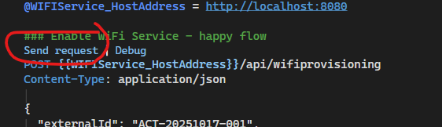
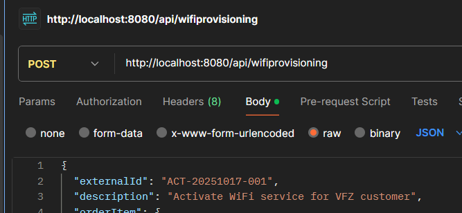

## README

### Instructions
1. Have docker installed on your machine
2. Navigate to TakeHomeAssignment\WIFIService
3. Fire the following command: Docker compose up
4. Then, either use postman or use the WIFIService.http file in VS (it can be found in the root of the api-project) to call the API endpoint.

- WIFIService.http: is already setup with two different API endpoint requests, just click on Send request:

- Postman: Your request setup should look like this (you can copy the body from the assignment and paste it, or copy it from the .http file):

### Docker

The project uses **Docker Compose** to spin up the full environment with a single command. Two services are defined:

- **`api`** — The WIFIService API, exposed on port `8080`.
- **`wiremock`** — A stub server that simulates the two external dependencies (NetworkInfrastructure on port `9001` and NetworkController on port `9002`).

The API is configured via environment variables to point at the WireMock container instead of real external services. This means the entire application can be run and tested locally without needing access to any real infrastructure. Docker guarantees the same environment on every machine, eliminating "works on my machine" issues.

### Architecture

The project follows **Clean Architecture** combined with **Domain-Driven Design (DDD)** principles. Dependencies point strictly inward — outer layers know about inner layers, never the reverse.

Clean Architecture ensures the business logic stays independent of frameworks, external services, and infrastructure details. This makes the core easy to test in isolation and resilient to change — swapping out an HTTP client or external API has no impact on the domain or application logic.

Domain-Driven Design keeps the code aligned with the business domain. Rather than modeling around technical concerns, the structure reflects the actual domain concepts of the problem being solved. This makes the codebase easier to reason about and extend as requirements evolve. It also helps in protecting the invariants and having an aggregate root helps with having a consistent way of altering the domain models.

- **`WIFIService.Domain`** — The core of the application. Contains the business logic and rules, completely isolated from any framework or infrastructure concern.
- **`WIFIService.Application`** — Orchestrates use cases. Defines interfaces (ports) for external dependencies, which are implemented by the infrastructure layer. Depends only on Domain.
- **`WIFIService.Infrastructure.External`** — Implements the interfaces defined in Application. Handles all communication with external systems.
- **`WIFIService.Api`** — The entry point. Handles HTTP concerns: routing, validation, mapping, and middleware. Depends on Application; never touches Infrastructure directly.
- **`WIFIService.Contracts`** — Holds the public request/response models for the API.
- **`WIFIService.WireMock`** — A stub server that simulates external dependencies for local development and testing.

### Error Handling

All error responses follow the [RFC 9457 Problem Details](https://www.rfc-editor.org/rfc/rfc9457) standard and are returned as `application/problem+json`.

Error handling is split across two layers:

**Application layer — Result pattern**
The service returns a `Result` instead of throwing for expected business failures. 
Which then is converted to a `ProblemDetails` response. Exceptions should be reserved for truly unexpected situations (bugs), not for predictable outcomes like "speed profile not found". Using Result makes the failure explicit in the method, forces the caller to handle it, and avoids the overhead and hidden control flow of exception throwing. Exceptions are also costy. Also, returning a result or throwing an exception says something about the intent: exceptions for situations you dont expect (bugs), errors for business failures.

**API layer — GlobalExceptionHandler**
Everything else then the result-pattern is caught centrally by the `GlobalExceptionHandler` middleware, which could be bugs (via exceptions) or ValidationExceptions. These are also converted to a problem details response.

### 